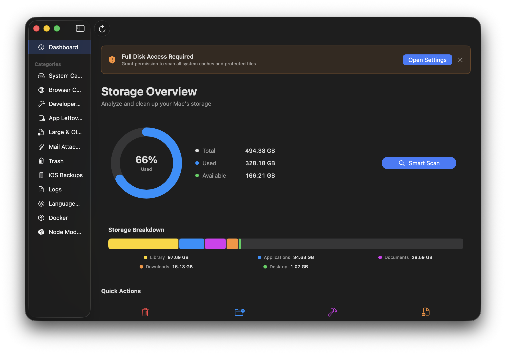
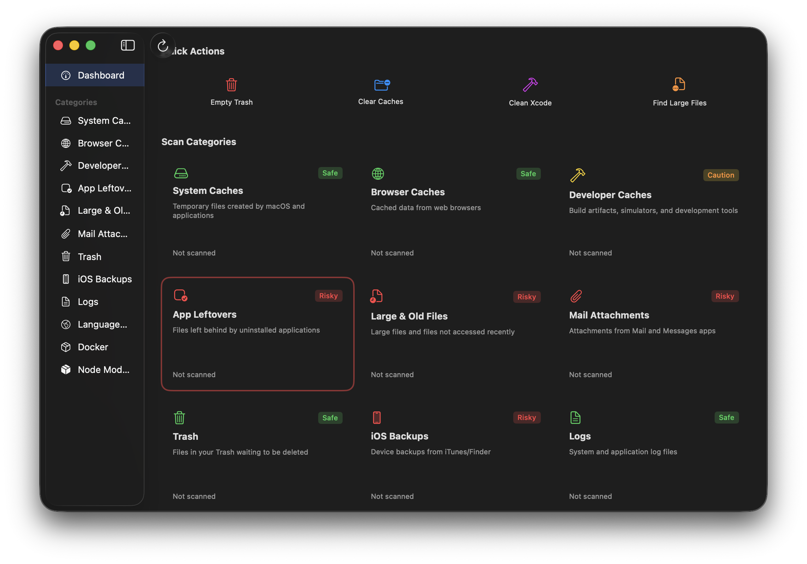
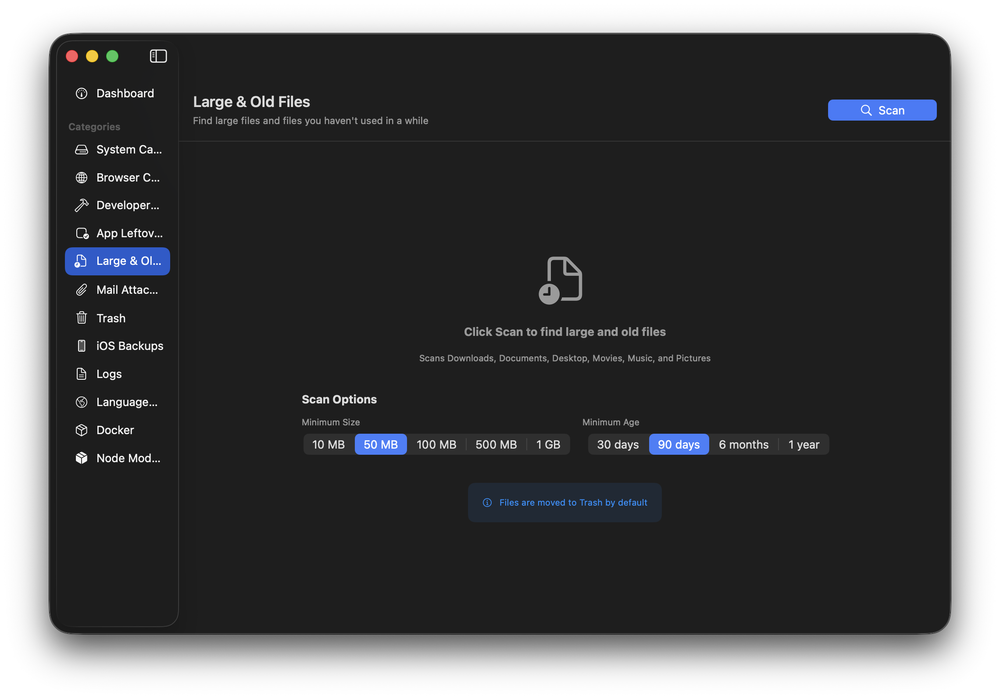

# SweepYourMac

A native macOS disk cleanup utility built with SwiftUI. Scan and clean caches, logs, developer files, and more to reclaim disk space.

## Screenshots

<p align="center">
  
</p>

<p align="center">
  
</p>

<p align="center">
  
</p>

## Features

SweepYourMac scans 12 categories of cleanable files:

| Category | Description | Safety |
|----------|-------------|--------|
| System Caches | Temporary files from macOS and apps | Safe |
| Browser Caches | Cached data from Safari, Chrome, Firefox, etc. | Safe |
| Logs | System and application log files | Safe |
| Trash | Files waiting to be permanently deleted | Safe |
| Developer Caches | Xcode, Gradle, CocoaPods, npm build artifacts | Caution |
| Language Files | Unused localizations in applications | Caution |
| Node Modules | node_modules folders in projects | Caution |
| Docker | Images, containers, volumes, build cache | Caution |
| App Leftovers | Files from uninstalled applications | Review |
| Large & Old Files | Large files not accessed recently | Review |
| Mail Attachments | Attachments from Mail and Messages | Review |
| iOS Backups | Device backups from Finder/iTunes | Review |

## Safety

SweepYourMac is designed with safety as a priority:

- **Move to Trash by default** - Deleted items go to Trash, not permanent deletion
- **Protected paths** - System directories (`/System`, `/usr`, `/bin`) are blocked
- **Symlink validation** - Prevents escaping to protected directories via symlinks
- **In-use detection** - Checks if files are in use before deletion with `lsof`
- **Today's files protected** - Won't delete logs/caches modified today
- **Color-coded safety levels** - Green (safe), Yellow (caution), Red (review carefully)

## Requirements

- macOS 13.0 (Ventura) or later
- Full Disk Access permission (for scanning all locations)

## Installation

### Download

Download the latest release from the [Releases](../../releases) page.

### Build from Source

```bash
# Clone the repository
git clone https://github.com/pyramidion-solutions/sweep-your-mac.git
cd sweep-your-mac

# Build with Xcode
xcodebuild -project SweepYourMac.xcodeproj -scheme SweepYourMac -configuration Release build

# Or open in Xcode
open SweepYourMac.xcodeproj
```

## Usage

1. **Grant Full Disk Access** - On first launch, grant Full Disk Access in System Settings > Privacy & Security
2. **Scan** - Click on a category to scan for cleanable files
3. **Review** - Items are color-coded by safety level. Review yellow/red items carefully.
4. **Clean** - Select items and click "Clean Selected" to move them to Trash

## Architecture

```
SweepYourMac/
├── Models/           # Data models (ScanCategory, ScanResult, DiskSpace)
├── Services/         # Scanner actors for each category
└── Views/            # SwiftUI views
```

Each scanner is implemented as a Swift `actor` for thread-safe file operations. The app uses MVVM with inline ViewModels in each view file.

## Contributing

Contributions are welcome! Please:

1. Fork the repository
2. Create a feature branch (`git checkout -b feature/amazing-feature`)
3. Commit your changes (`git commit -m 'Add amazing feature'`)
4. Push to the branch (`git push origin feature/amazing-feature`)
5. Open a Pull Request

## The Story

One evening, my Mac showed the dreaded "Storage Almost Full" warning — **3.8GB free** out of 460GB. I needed to reclaim space fast.

I started with the usual terminal commands:
```bash
du -sh ~/* | sort -hr | head -20
```

What followed was a 2-hour deep dive through hidden folders, discovering space hogs I never knew existed:

- **18GB** in `~/.gradle/caches` — Android build cache I forgot about
- **9.7GB** in `~/.android/avd` — Emulators I hadn't used in months
- **11GB** in `~/Library/Caches/Google` — Chrome hoarding data
- **22GB** in `~/fvm/versions` — Old Flutter SDKs piling up
- **23GB** in Docker — Containers and images from forgotten projects
- **6GB** in Homebrew caches
- **5GB** in CocoaPods repos

Command after command, folder after folder, I cleared **125GB** and went from **3.8GB → 129GB free**.

But the experience was painful:
- Running `du -sh` dozens of times
- Googling "is it safe to delete ~/.gradle/caches"
- Carefully typing `rm -rf` commands hoping I wouldn't break something
- Discovering macOS Storage shows "Documents: 153GB" when the actual folder is 47GB (thanks Apple 🙄)

**I thought: why isn't there an open-source CleanMyMac?**

Something that knows where developers hide their caches. Something that understands Xcode DerivedData, node_modules sprawl, and Docker bloat. Something free and transparent.

So I built **SweepYourMac** — the cleanup tool I wished I had that evening.

## License

This project is licensed under the MIT License - see the [LICENSE](LICENSE) file for details.

## Acknowledgments

Built with SwiftUI for macOS.
